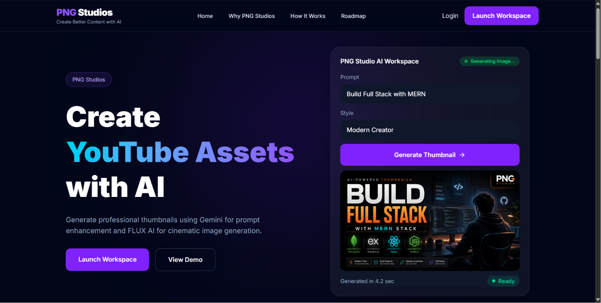
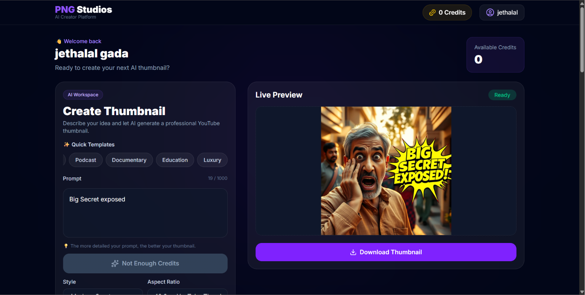
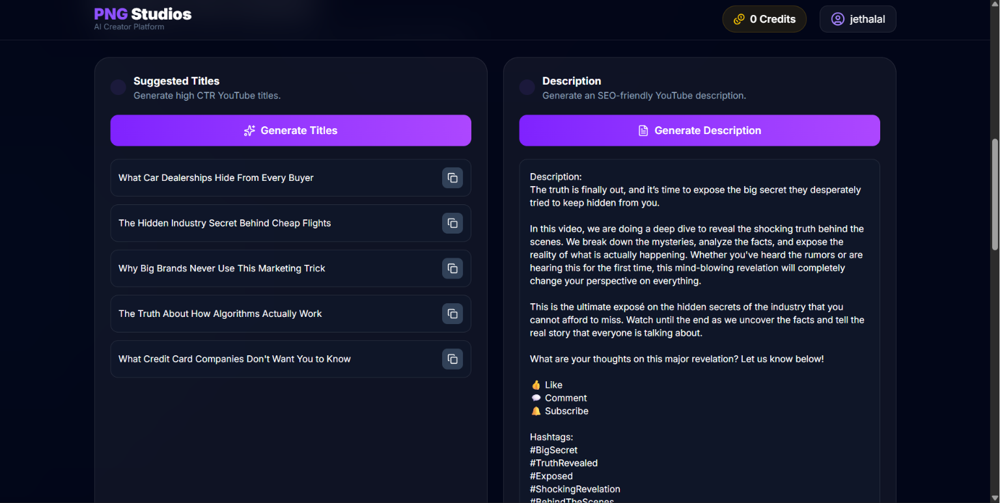
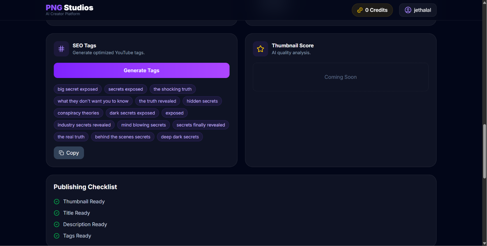
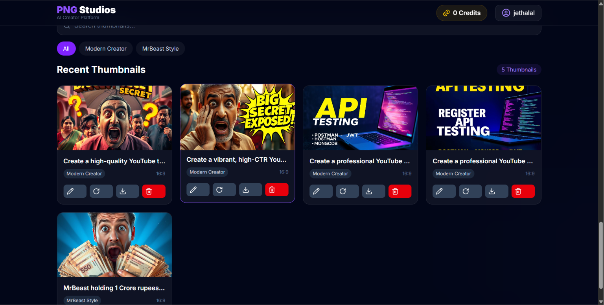

<div align="center">

# 🎨 PNG Studios

### AI-Powered YouTube Thumbnail Generation Platform

Create professional YouTube thumbnails in seconds using AI.

Built with **MERN**, **Google Gemini**, **Hugging Face**, **Pollinations AI**, **Cloudinary**, and **MongoDB**.

[🌐 Live Demo](https://pngstudios.vercel.app) • [📂 Repository](https://github.com/priteshgholap2004/ai-thumbnail-studio)

</div>

---

# ✨ Features

## 🎨 AI Thumbnail Generator

- Generate high-quality YouTube thumbnails
- Multiple thumbnail styles
- Aspect ratio selection
- Live thumbnail preview

## 🤖 AI Prompt Enhancement

- Google Gemini enhances user prompts
- Better prompts produce higher-quality thumbnails
- Optimized automatically before generation

## 🖼 Intelligent Image Generation

Primary Provider

- Hugging Face FLUX Models

Automatic Fallback

- Pollinations AI

## ☁ Cloud Storage

- Cloudinary image hosting
- Fast delivery
- Secure URLs
- Optimized images

## 👤 Authentication

- Register
- Login
- Logout
- JWT Authentication
- Protected Routes
- Forgot Password
- Reset Password

## 💳 Credits System

- Credit-based thumbnail generation
- Credit validation
- User dashboard

## 📚 Thumbnail History

- View previous thumbnails
- Search thumbnails
- Delete thumbnails
- Download thumbnails

## 🚀 Creator Assistant

Generate AI powered

- Titles
- Descriptions
- SEO Tags

---

# 🛠 Tech Stack

## Frontend

- React
- Vite
- Tailwind CSS
- React Router
- Axios
- Framer Motion
- React Hot Toast
- Lucide Icons

## Backend

- Node.js
- Express.js
- MongoDB
- Mongoose
- JWT
- Cookie Parser
- Resend Email

## AI Services

- Google Gemini
- Hugging Face
- Pollinations AI

## Cloud

- Cloudinary

---

# 🏗 Architecture

```
User Prompt
      │
      ▼
Google Gemini
(Prompt Enhancement)
      │
      ▼
Hugging Face
      │
      ├────────────── Success
      │                   │
      │                   ▼
      │             Cloudinary
      │
      └────────────── Failed
                          │
                          ▼
                  Pollinations AI
                          │
                          ▼
                     Cloudinary
                          │
                          ▼
                      MongoDB
```

---

# 📸 Screenshots

## Landing Page



## Workspace



## Creator Assistant




## Thumbnail History



---

# 📂 Project Structure

```
client/
    src/
        components/
        context/
        pages/
        routes/
        services/

server/
    src/
        controllers/
        middleware/
        models/
        prompts/
        routes/
        services/
        utils/
```

---

# ⚙ Installation

## Clone Repository

```bash
git clone https://github.com/priteshgholap2004/ai-thumbnail-studio.git
```

```
cd ai-thumbnail-studio
```

---

## Backend

```
cd server
npm install
npm run dev
```

---

## Frontend

```
cd client
npm install
npm run dev
```

---

# 🔐 Environment Variables

Backend

```env
PORT=

MONGO_URI=

JWT_SECRET=

JWT_EXPIRE=

CLIENT_URL=

GEMINI_API_KEY=

HF_API_KEY=

CLOUDINARY_CLOUD_NAME=

CLOUDINARY_API_KEY=

CLOUDINARY_API_SECRET=

RESEND_API_KEY=
```

---

# 🚀 API Features

Authentication

- Register
- Login
- Forgot Password
- Reset Password

Thumbnail

- Generate Thumbnail
- Thumbnail History
- Delete Thumbnail
- Download Thumbnail

Creator Assistant

- Generate Titles
- Generate Descriptions
- Generate SEO Tags

---

# 🎯 Future Improvements

- Thumbnail Quality Scoring
- More AI Models
- Custom Templates
- Team Collaboration
- Image Editing

---

# 👨‍💻 Author

**Pritesh Gholap**

GitHub

https://github.com/priteshgholap2004

LinkedIn

(Add LinkedIn)

---

# ⭐ Support

If you like this project, consider giving it a ⭐ on GitHub.